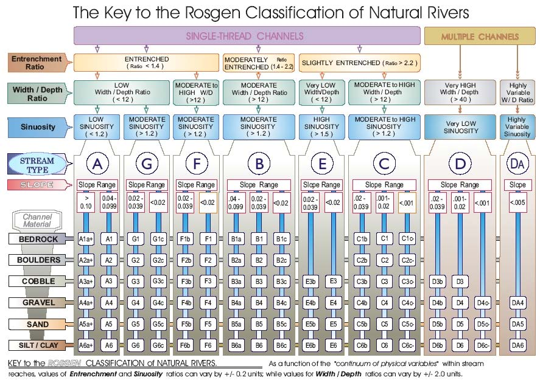

## Introduction

The Rosgen Stream classification is a method for interpreting stream and river system processes and classifying them based on the form or morphology of the stream/river at a particular moment in time. GIS is increasingly used to aid these classifications, but it's application has not been standardized. Moreover, the classifications are widely used in the fields of environmental management, impact assessment, and ecosystem restoration. Therefore, we will attempt to create and practice a replicable technique for appling high-resolution terrain models to classify sections of streams and rivers (what geomorphologists call "reaches").

### Main Questions for this Topic
  - How do geomorphologists use spatial analysis to classify river and stream systems?
  - How can we implement the spatial analysis for stream classification using geographic information systems?
  - Can we demonstrate the use of a research compendia in the setting of an undergraduate methods course? 
  - To what degree might data errors and uncertainty in analytical techniques create uncertainty and problems of reproducibility in research involving stream classification?

### Software
  - [GRASS](https://grass.osgeo.org/) (installs automatically with QGIS)
  - [RStudio Desktop](https://rstudio.com/) (popular free software for using the open source [R Project of Statistical Computing](https://www.r-project.org/) programming language)
  
### Hardware
  - The data files in this lab are several gigabytes: if your internal hard drive is small, you'll want an external hard drive.
  - The evening lab space supports plenty of power adapters and ample desktop space for mice and keyboards.
  
### Instructions

In this lab, we will experiment with learning from a research repository. Therefore, most of the data and instructions are included in the repository as if Zach and coauthors were working on a research publication. Data, or instructions for downloading it, are included in the `data` folder, and information about that data is included in `metadata`. 

1. Start by using the GitHub website to *fork* the [rosgenrr respository](https://github.com/GIS4DEV/rosgenrr) from the GIS4DEV organization to your own GitHub account.
1. Then use GitHub Desktop to *clone* your version of the repository to a location with *plenty of storage capacity* as this project uses some very large GIS datasets.
1. Some files are too large for GitHub versioning and servers to handle. We'll treat these as `private` data sources, so that GitHub does not try to control or sync them. 
1. Please download [https://geography.middlebury.edu/jholler/data/rosgenrr/JohnDayWShed.zip](https://geography.middlebury.edu/jholler/data/rosgenrr/JohnDayWShed.zip) to your `rosgenrr/data/raw/private` folder and unzip their contents in the same `rosgenrr/data/raw/private` folder.
1. Optionally, you may also download [aerial orthophotography](https://geography.middlebury.edu/jholler/data/rosgenrr/JohnDayWShed_OrthoPrj.zip) of part of the region to the private folder:
1. As you plan for and complete the replication, complete the replication report template found in `docs/report/HEGSRR-Replication-Report.md` and copy it for inclusion in your GitHub Pages.
1. Follow the procedures enumerated in the repository's `procedure` folder, going in the same order as the procedures listed in `procedure_metadata.csv`. The procedures work through the process of creating variables required for a Rosgen Level II Stream Classification, illustrated by the Environmental Protection Agency's flowchart: 

**Need to Add: Protocol for choosing/assigning research sites**

#### GRASS

<iframe width="560" height="315" src="https://www.youtube.com/embed/cZia3ShzTWM" frameborder="0" allow="accelerometer; autoplay; clipboard-write; encrypted-media; gyroscope; picture-in-picture" allowfullscreen></iframe>